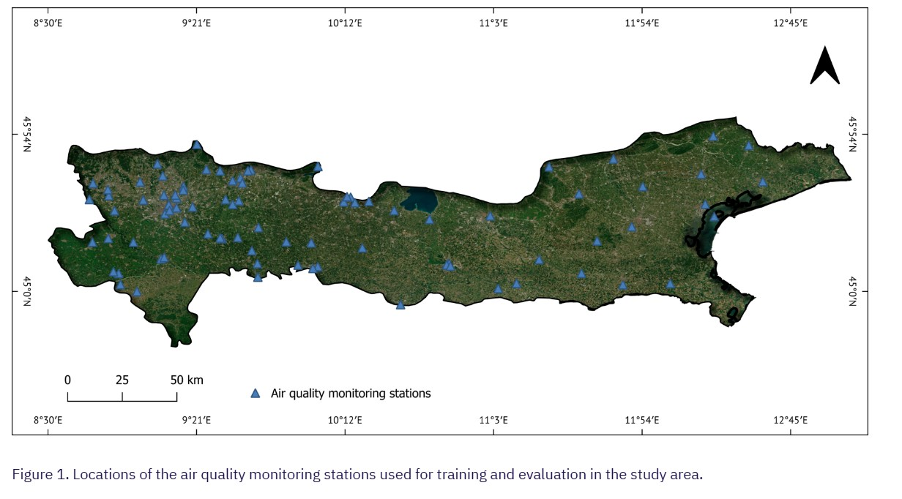

# GeoAI-ground-level-NO2-estimation
 The Project aims to develop precise ML model(s) to estimate surface NO2 concentrations using only public remote sensing data as predictor variables.

## Project Overview

The **GeoAI Ground-Level NO2 Estimation Challenge** is an open project aimed at developing innovative machine learning models to estimate surface-level nitrogen dioxide (NO2) concentrations. NO2 is a significant air pollutant with severe implications for human health and the environment. The project encourages participants to create models using public remote sensing data, which can effectively predict NO2 levels across various geographical locations and seasons.

### Objective

The primary goal of this project is to build machine learning models that accurately estimate surface NO2 concentrations. The models should leverage remote sensing data provided by Google Earth Engine (GEE) alongside ground truth NO2 data from air quality monitoring stations. The competition emphasizes the need for transparency, reproducibility, and innovation in the model development process.

Participants are expected to:
- **Ensure transparency** by clearly documenting each step of the model development process, including data preprocessing, feature selection, model architecture, and hyperparameter tuning.
- **Demonstrate reproducibility** by providing well-organized code and thorough documentation, allowing others to replicate their results.
- **Develop adaptable models** capable of estimating NO2 levels across different weather conditions and seasons, ensuring robustness and generalizability.
- **Innovate** by exploring new approaches to NO2 monitoring and modeling, potentially contributing to more effective environmental monitoring techniques.

## Data Overview

### Ground Truth Data

The ground truth data consists of NO2 concentration measurements collected from various air quality monitoring stations. This data serves as the reference for training and evaluating the machine learning models. Key features of this dataset include:
- **Geographical Location:** Coordinates of the monitoring stations where NO2 levels were recorded.
- **Temporal Data:** Timestamp information indicating when the NO2 measurements were taken.
- **NO2 Concentrations:** Actual measured values of NO2 at the given times and locations.

### Remote Sensing Data

The remote sensing data provided in this challenge is processed using Google Earth Engine (GEE). This data includes various environmental and atmospheric variables that can be used as predictors in the models. The remote sensing data may include:
- **Aerosol Optical Depth (AOD):** A measure of the extinction of solar radiation by atmospheric aerosols.
- **Temperature and Humidity:** Meteorological data that can influence NO2 concentrations.
- **Vegetation Indices:** Indicators of vegetation health that can affect local air quality.
- **Land Surface Temperature (LST):** Surface temperature measurements, which can correlate with pollution levels.

The combination of ground truth and remote sensing data provides a comprehensive dataset for developing robust models capable of accurately estimating NO2 concentrations in diverse conditions.

Air Quality monitoring stations in study area (Italy)

## Importance of the Project

The GeoAI Ground-Level NO2 Estimation Challenge is a critical initiative with significant implications for public health and environmental sustainability. Nitrogen dioxide (NO2) is a major pollutant resulting from vehicle emissions, industrial processes, and other anthropogenic activities. Prolonged exposure to high levels of NO2 can lead to severe respiratory issues, including asthma and bronchitis, and is linked to increased mortality rates.

### Alignment with Global Goals

This challenge is part of the **AI for Good** initiative, organized by the International Telecommunication Union (ITU) in collaboration with 40 United Nations Sister Agencies. The AI for Good initiative seeks to harness the power of artificial intelligence to advance the United Nations Sustainable Development Goals (SDGs). By developing models that accurately monitor NO2 levels, participants contribute to the broader goal of reducing air pollution and mitigating its effects on human health and the environment.

### Broader Impact

Accurate NO2 monitoring is crucial for:
- **Public Health:** Providing real-time data on air quality helps in issuing timely health warnings, thereby protecting vulnerable populations.
- **Policy Making:** Governments and environmental agencies can use the insights gained from these models to implement more effective pollution control measures.
- **Environmental Protection:** Understanding NO2 patterns can aid in identifying pollution hotspots and devising strategies to reduce emissions.

In summary, this project not only serves as a platform for technological innovation but also contributes to global efforts in improving air quality and safeguarding human health.

## Conclusion

The GeoAI Ground-Level NO2 Estimation Challenge represents an exciting opportunity to apply machine learning techniques to a real-world problem with significant global implications. By participating, you are contributing to a cause that directly impacts public health and environmental sustainability while advancing your skills in data science and machine learning.

---
